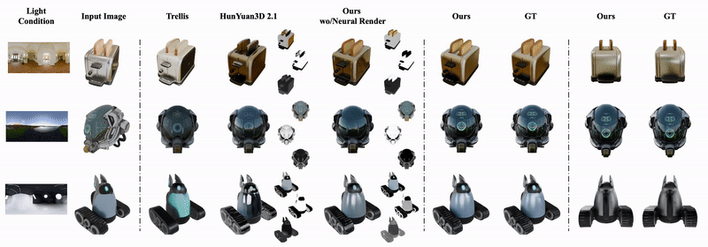
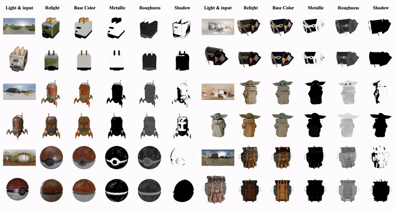

# NeAR

<div align="center">
  
</div>

<div align="center">
  <a href="https://arxiv.org/abs/2511.18600"></a>
  <a href="https://near-project.github.io/"></a>
  <a href="https://huggingface.co/luh0502/NeAR/tree/main"></a>
  <a href="https://huggingface.co/spaces/luh0502/NeAR"></a>
</div>

**NeAR** is a relightable 3D generation and rendering project built on top of **TRELLIS-style Structured Latents (SLAT)** and a lighting-aware neural renderer. Given a casually lit input image, NeAR estimates relightable neural assets and renders them under novel environment lighting and viewpoints.

This repository combines:

- a **TRELLIS-derived latent pipeline** for image-conditioned SLAT prediction,
- a **lighting-aware neural renderer** conditioned on HDR environment maps,
- an optional **geometry frontend** based on **Hunyuan3D-2.1**,
- tools for **single-view relighting**, **novel-view relighting**, **HDRI rotation videos**, and **GLB export**.

<!-- For more details, please check the [project page](https://near-project.github.io/), the [paper on arXiv](https://arxiv.org/abs/2511.18600), and the [Hugging Face model repository](https://huggingface.co/luh0502/NeAR/tree/main). -->

## Release Status

- [✓] Checkpoints / model weights
- [✓] Inference code
- [✓] Hugging Face demo
- [✓] Data release
- [ ] Training code

## News
- Inference code and Checkpoints have been released! 
- ⭐ **2025.04** — NeAR has been selected as a **Highlight** at **CVPR 2026**! 
- The Hugging Face demo is currently being deployed.
- Data and training code are coming soon.

## Teaser

<div align="center">
  
</div>

**Relightable 3D generative rendering results.** Columns from left to right depict the target illumination, the casually lit input image, Blender-rendered results from Trellis 3D, Hunyuan 3D-2.1 (with PBR materials), our method's estimated multi-view PBR materials back-projected onto the given mesh, our neural rendering results, and ground truth.

## Example Relighting / Material Videos

The following videos are produced by the local NeAR example pipeline and are useful for quickly previewing:

- **Novel-view relighting video**: camera moves while the illumination stays fixed.
- **HDRI rotation preview**: environment map rotates while the camera stays fixed.
- **Relighting under rotating HDRI**: material response changes under time-varying illumination.

<div align="center">
  
</div>

<!-- If these local videos are not present, you can generate them with `example.py` and `--video_frames > 0`. -->

---

## Overview

NeAR couples **asset representation** and **renderer design**:

- **Asset side**: from an input image, a structured latent representation stores geometry-aware and material-aware information in a compact sparse latent.
- **Renderer side**: a neural renderer takes the latent, view parameters, and an HDR environment map, then predicts relightable outputs such as color, base color, metallic, roughness, and shadow.

Compared with a standard image-to-3D pipeline, NeAR focuses on:

- **relighting under novel HDR illumination**,
- **view-consistent rendering**,
- **fast feed-forward inference**, and
- **material-aware rendering outputs**.

---

## Repository Structure

Key files and directories:

- `example.py` — minimal end-to-end inference example.
- `app_e.py` — Gradio-style demo / app script.
- `app_viser.py` — interactive neural relight viewer ([viser](https://github.com/viser-project/viser)); orbit camera + HDRI controls, full-viewport relit RGB (no GLB).
- `setup.sh` — environment setup helper.
- `checkpoints/` — local pipeline configuration and model checkpoints.
- `trellis/pipelines/near_image_to_relightable_3d.py` — main NeAR inference pipeline.
- `trellis/utils/render_utils_rl.py` — relighting rendering utilities.
- `trellis/datasets/hdri_processer.py` — HDRI preprocessing and rotation helpers.
- `hy3dshape/` — Hunyuan3D shape utilities from [Tencent-Hunyuan/Hunyuan3D-2.1/hy3dshape](https://github.com/Tencent-Hunyuan/Hunyuan3D-2.1/tree/main/hy3dshape).

---

## Installation

### Requirements

- Linux
- NVIDIA GPU
- Python 3.10+ recommended
- CUDA-compatible PyTorch environment

NeAR inherits many dependencies from TRELLIS and additionally uses relighting-related packages such as `pyexr`, `simple_ocio`, `open3d`, and the local `hy3dshape` module.

### Setup

Use the provided setup script as a starting point:

```bash
git clone --recursive https://github.com/Luh1124/NeAR.git
cd NeAR
. ./setup.sh --help
```

A typical TRELLIS-style setup may look like:

```bash
. ./setup.sh --new-env --basic --xformers --flash-attn --diffoctreerast --spconv --kaolin --nvdiffrast --hy3d --gsplat
```

Depending on your environment, you may still need to manually install extra packages used by NeAR, for example:

```bash
pip install pyexr simple-ocio open3d rembg imageio easydict
```

<!-- If you use Hunyuan3D geometry generation, make sure the `hy3dshape` dependencies are also installed. The `hy3dshape` module is sourced from [Tencent-Hunyuan/Hunyuan3D-2.1/hy3dshape](https://github.com/Tencent-Hunyuan/Hunyuan3D-2.1/tree/main/hy3dshape). -->

### Viser viewer (optional)

For an interactive neural relighting window (orbit camera, HDRI rotation, low-res while dragging):

```bash
pip install "viser>=1.0.0"   # or: . ./setup.sh --demo
python app_viser.py --slat path/to/slat.npz --hdri path/to/env.exr --port 8080
```

By default the viewer **letterboxes** the square neural render into the browser viewport so the subject is not stretched on wide windows. Use `--no-letterbox` to restore the old full-viewport stretch.

Neural rendering uses perspective **clip planes** (`--clip-near` / `--clip-far`, defaults `0.05` / `32`). The old pipeline default `far=3` only matched orbit radius ~2; pulling the camera out (larger radius) needs a larger far plane or the object disappears.

For a **public link** (experimental), use `--share` and/or the GUI button **Get share URL (tunnel)**; this calls viser’s `request_share_url()` and may require outbound network access. For production sharing, prefer your own reverse proxy, SSH tunnel, or a tunneling tool.

The pipeline exposes `render_relight_color_numpy(hs, rfs, hdri_cond, ...)` for cached decoder / lighting tokens. See `python app_viser.py --help`.

---

## Checkpoints

The local pipeline configuration is defined in:

- `checkpoints/pipeline.yaml`

It references the main model components used by NeAR, including:

- `decoder`
- `hdri_encoder`
- `neural_basis`
- `renderer`
- `slat_flow_model`

The geometry model is currently run separately in `example.py` via:

- `tencent/Hunyuan3D-2.1`

### Stage-1 Data

The first-stage training data is available on Hugging Face:

- [luh0502/NeAR](https://huggingface.co/datasets/luh0502/NeAR) — stage-1 dataset

### HDR Environment Maps

Preprocessed HDR environment maps used for training and inference:

- [luh0502/hdr_envmaps_exr_4K](https://huggingface.co/datasets/luh0502/hdr_envmaps_exr_4K) — 4K resolution, normalized to 0–65536 float EXR

---

## Inference

NeAR supports two inference paths:

1. **Image → relightable result** — preprocess image → generate geometry (Hunyuan3D) → predict SLAT → render under target HDRI.
2. **Existing SLaT → relightable result** — skip geometry/latent generation, render directly from a saved `.npz`.

For detailed instructions, command-line examples, output descriptions, and API usage, see [**doc/infer.md**](doc/infer.md).

Quick start:

```bash
python example.py \
  --image assets/example_image/T.png \
  --hdri assets/hdris/studio_small_03_1k.exr \
  --out_dir relight_out
```

## Related Projects

- [TRELLIS](https://github.com/microsoft/TRELLIS)
- [NeAR Project Page](https://near-project.github.io)
- [Hunyuan3D](https://huggingface.co/tencent/Hunyuan3D-2.1)
- [DiLightNet](https://dilightnet.github.io/)
- [Neural Gaffer](https://neural-gaffer.github.io/)
- [DiffusionRenderer](https://research.nvidia.com/labs/toronto-ai/DiffusionRenderer/)
- [MeshGen](https://heheyas.github.io/MeshGen/)
- [RGB↔X](https://zheng95z.github.io/publications/rgbx24)

---

## Acknowledgements

This repository builds on and adapts ideas, codebases, and problem settings from several recent works on structured 3D latents, relighting, inverse rendering, and PBR-aware 3D generation, including:

- **TRELLIS** for structured latent generation and sparse 3D asset representations,
- **Hunyuan3D 2.1** for image-to-geometry generation,
- **DiLightNet** and **Neural Gaffer** for diffusion-based lighting control and object relighting,
- **DiffusionRenderer** for neural inverse / forward rendering under complex appearance and illumination,
- **MeshGen** for PBR textured mesh generation,
- **RGB↔X** for material- and lighting-aware decomposition and synthesis,

We thank the authors of these projects for releasing their papers, code, models, and project pages. If you use this repository, please also check the licenses and terms of the upstream dependencies and models.

## BibTeX

If you find this project useful, please consider citing our paper:

```bibtex
@inproceedings{li2025near,
  title={NeAR: Coupled Neural Asset-Renderer Stack},
  author={Li, Hong and Ye, Chongjie and Chen, Houyuan and Xiao, Weiqing and Yan, Ziyang and Xiao, Lixing and Chen, Zhaoxi and Xiang, Jianfeng and Xu, Shaocong and Liu, Xuhui and Wang, Yikai and Zhang, Baochang and Han, Xiaoguang and Yang, Jiaolong and Zhao, Hao},
  booktitle={CVPR},
  year={2026}
}
```